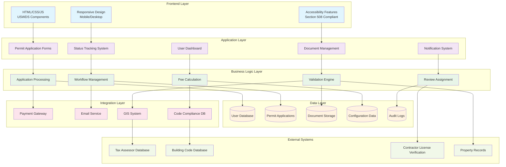
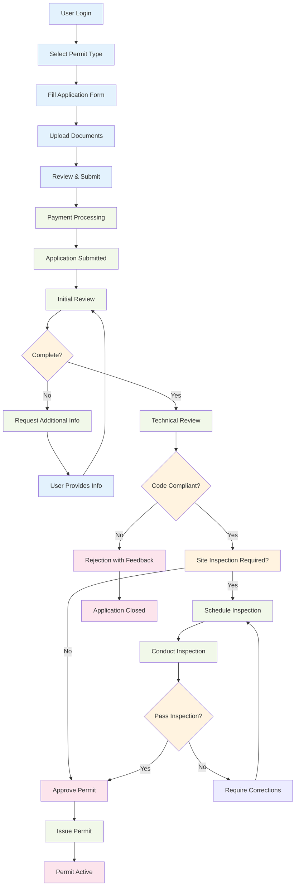

# City Permitting Portal

A modern web application built with the U.S. Web Design System (USWDS) for streamlined government permit applications and tracking.

## Overview

This application provides citizens with an intuitive interface to:
- Apply for various types of permits (building, electrical, plumbing, mechanical)
- Track application status in real-time
- View application history and dashboard
- Access required forms and documentation

## Features

### 🏛️ Government-Compliant Design
- Built with USWDS 3.7.1 for accessibility and consistency
- Section 508 compliant
- Mobile-responsive design
- Clear information hierarchy

### 📝 Permit Application System
- Multi-step application forms
- Document upload functionality
- Real-time form validation
- Draft saving capability

### 📊 Dashboard & Tracking
- User dashboard with application statistics
- Real-time status updates
- Application timeline visualization
- Search functionality for tracking permits

### 🔐 User Management
- Secure user authentication
- Role-based access (citizens, staff, administrators)
- Application history tracking

## Application Architecture



## Technology Stack

- **Frontend**: HTML5, CSS3, JavaScript
- **UI Framework**: U.S. Web Design System (USWDS) 3.7.1
- **Responsive Design**: CSS Grid and Flexbox
- **Accessibility**: WCAG 2.1 AA compliant
- **Icons**: USWDS Icon Library
- **Forms**: Native HTML5 form validation

## Application Flow

### Permit Application Process



## User Roles & Permissions

### Citizens
- Submit permit applications
- Track application status
- Upload required documents
- View application history
- Receive notifications

### Staff Reviewers
- Review applications for completeness
- Conduct technical reviews
- Request additional information
- Schedule inspections
- Update application status

### Administrators
- Manage user accounts
- Configure permit types and fees
- Generate reports
- System maintenance

## File Structure

```
/
├── index.html              # Main application page
├── README.md              # This file
├── assets/
│   ├── css/
│   │   └── custom.css     # Custom styles
│   ├── js/
│   │   └── app.js         # Application JavaScript
│   └── images/
├── forms/
│   ├── building-permit.html
│   ├── electrical-permit.html
│   └── plumbing-permit.html
└── docs/
    ├── api-documentation.md
    └── deployment-guide.md
```

## Getting Started

1. Clone the repository
2. Open `index.html` in a web browser
3. The application uses CDN links for USWDS, so no build process is required for basic functionality

## Features Implemented

### ✅ Current Features
- Responsive design with USWDS components
- Multi-section permit application form
- Application dashboard with status cards
- Timeline visualization for application tracking
- Document upload interface
- Status tracking system
- Accessibility features

### 🚧 Future Enhancements
- Backend API integration
- Real-time notifications
- Payment processing
- Advanced search and filtering
- Bulk operations for staff
- Mobile app companion
- Integration with GIS systems
- Automated code compliance checking

## Browser Support

- Chrome 90+
- Firefox 88+
- Safari 14+
- Edge 90+
- Mobile browsers (iOS Safari, Chrome Mobile)

## Accessibility

This application is built to meet:
- WCAG 2.1 AA standards
- Section 508 compliance
- Keyboard navigation support
- Screen reader compatibility
- High contrast mode support

## Contributing

1. Fork the repository
2. Create a feature branch (`git checkout -b feature/amazing-feature`)
3. Commit your changes (`git commit -m 'Add some amazing feature'`)
4. Push to the branch (`git push origin feature/amazing-feature`)
5. Open a Pull Request

## License

This project is in the public domain and is not subject to copyright restrictions.

## Support

For technical support or questions about the application:
- Email: dev-support@springfield.gov
- Documentation: [Link to full documentation]
- Issue Tracker: [GitHub Issues]

---

Built with ❤️ using the U.S. Web Design System